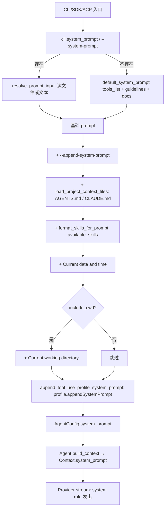

# System Prompt & Start-time Injection

> Pi 在每一次启动 / 每一次构建 `AgentConfig` 时,都会把多段 prompt 文本按固定顺序拼成 `system_prompt` 字符串,作为 `Context { system_prompt, messages, tools }` 的最顶层字段,再交给各 provider 发出。
>
> 这份文档是 system prompt 装配顺序 / 各段来源 / 各入口行为的单一真相源,所有改动 system prompt 的工作都要先回到这里对位置。
>
> 适用 reader: 改默认 prompt / 改 skills 装配 / 改 provider 模板 / 改 tool-use profile / 排查"模型为什么看到/没看到某段说明"时优先读。

## 1. 装配入口

- 主装配函数: `src/app.rs::build_system_prompt` (line 151-194, 标注 `#[allow(clippy::too_many_arguments)]`)。
- 该函数返回的 `String` 还要再过一次 `src/app.rs::append_tool_use_profile_system_prompt` (line 201-244) 才会塞进 `AgentConfig`。
- CLI / SDK / ACP 三个入口都走这条同一链路 (`src/main.rs:1417-1443`、`src/sdk.rs:1750-1810`、`src/acp.rs:1205`)。
- 之后由 `src/agent.rs::Agent::build_context` (line 1666-1700) 把它拷到 `Context.system_prompt`;各 provider 负责把这条字段映射成自己的 system role (`src/providers/openai.rs:301-309` 等)。

## 2. 装配顺序

`build_system_prompt` 内部按以下顺序拼接,前面的内容会被后面的覆盖或追加:



注意顺序决定了几件事:

- `--system-prompt` 是"整体替换",不是追加;会跳过 `default_system_prompt`。
- `--append-system-prompt` 一定在 `default_system_prompt` 之后、`AGENTS.md/CLAUDE.md` 之前。
- `AGENTS.md` / `CLAUDE.md` 在 skills 段之前,skills 段不会被项目上下文覆盖。
- `Current date and time` / `Current working directory` 永远是最后一两行,放在最容易被新模型"漏看"的位置 (故意的: 人类阅读顺序)。
- profile prompt 是装配完所有上述内容之后再追加,并带 `# Tool-use profile: <name>` marker 做幂等去重 (`src/app.rs:228-235`)。

## 3. 各段来源速查表

| # | 内容 | 来源 / 解析 | 代码位置 | 是否可空 / 可关 |
|---|------|------------|----------|------------------|
| 1 | 基础 prompt | `default_system_prompt` 或 `--system-prompt` 文件/文本 | `src/app.rs:151-194` / `267-364` | `--system-prompt` 整段替换 |
| 2 | `--append-system-prompt` | 文本或文件,经 `resolve_prompt_input` 解析 | `src/cli.rs:333-335` / `src/app.rs:259-264` | 没传则空 |
| 3 | `# Project Context` 段 | `load_project_context_files` 找 `AGENTS.md` / `CLAUDE.md` | `src/app.rs:384-422` | 找不到任何文件则空 |
| 4 | `<available_skills>` 段 | `format_skills_for_prompt` 拼 skill 列表 | `src/resources.rs:1335-1371` | 没有任何 `disable_model_invocation=false` 的 skill 时空 |
| 5 | `Current date and time` | `Local::now()` 格式化 | `src/app.rs:425-434` | 总是注入,`PI_TEST_MODE` 下用 `<TIMESTAMP>` |
| 6 | `Current working directory` | `cwd.display().to_string()` | `src/app.rs:204-211` | 由 `--hide-cwd-in-prompt` 或 `PI_HIDE_CWD_IN_PROMPT` 控制 |
| 7 | `# Tool-use profile: <name>` 段 | `models.json::toolUseProfiles[*].appendSystemPrompt` | `src/app.rs:201-244` / `src/models.rs:155-220` | profile 没配则空;`enabled_tools` 空也跳过 |
| 8 | 运行时 semantic context | `SemanticContextBundleInjection` 路径 | `src/agent.rs:1093-1112` | 显式 opt-in 才注入 |
| 9 | Extension 注册的 system prompt | `systemPrompt` / `system_prompt` 字段 | `src/extension_events.rs:163, 365, 380-385` | extension 主动注册才有 |

## 4. 默认 system prompt 的内部结构

`src/app.rs:267-364` 的 `default_system_prompt(enabled_tools, package_dir)` 是一段硬编码字符串,固定包含:

1. **角色定位句**: `"You are an expert coding assistant operating inside pi, a coding agent harness..."`。
2. **`Available tools:` 段**: 从内置 `tool_descriptions` 数组里挑 `enabled_tools` 命中的工具,每行 `- <tool>: <description>`。`enabled_tools` 为空则显示 `(none)`。
3. **补丁句**: `"In addition to the tools above, you may have access to other custom tools depending on the project."`。
4. **`Guidelines:` 段**: 按已启用工具组合动态拼的若干行 (举几例):
   - `bash` 已启用但 `grep`/`find`/`ls` 未启用 → "Use bash for file operations like ls, rg, find"。
   - `bash` 和 (`grep` 或 `find` 或 `ls`) 同时启用 → "Prefer grep/find/ls tools over bash for file exploration..."。
   - `read` + `edit` → "Use read to examine files before editing. You must use this tool instead of cat or sed."。
   - `edit` → "Use edit for precise changes (old text must match exactly)"。
   - `hashline_edit` + `read` → "For large files or complex multi-site edits, use read or grep with hashline=true..."。
   - `write` → "Use write only for new files or complete rewrites"。
   - `edit` 或 `write` → "When summarizing your actions, output plain text directly - do NOT use cat or bash..."。
   - 兜底: "Be concise in your responses"、"Show file paths clearly when working with files"。
5. **Pi 文档导引段**: 硬编码的 `{package_dir}/README.md`、`/docs`、`/examples` 路径,以及 "When asked about: extensions (docs/extensions.md, ...)" 的 cross-reference 表,告诉模型读 `.md` 前先看 cross-references。

`resolve_prompt_input` (`src/app.rs:259-264`) 把"传字符串"和"传文件路径"统一: 路径存在则当文件读,否则当字面量。

## 5. Skills 段的拼装

- 装配函数: `src/resources.rs:format_skills_for_prompt` (line 1335-1371)。
- 只在 `enabled_tools` 包含 `"read"` 时挂入 (`src/main.rs:1411-1414`),这是"模型必须能用 read 才能读 SKILL.md"的前置条件。
- 过滤规则: `disable_model_invocation=true` 的 skill 不出现在列表里 (`src/resources.rs:1336-1338`)。
- 渲染格式: 每个 skill 渲染成
  ```xml
  <available_skills>
    <skill>
      <name>...</name>
      <description>...</description>
      <location>...SKILL.md 绝对路径...</location>
    </skill>
  </available_skills>
  ```
  XML escape 走 `escape_xml` (`src/resources.rs:1373-1380`)。
- 加载路径: 全局 `~/.rpi/agent/skills/<name>/SKILL.md`、项目 `<cwd>/<Config::project_dir()>/skills`、显式 `--skill <path>` (`src/resources.rs:999-1051`)。完整 spec 见 [`docs/skills.md`](skills.md)。

## 6. 项目上下文段 (`AGENTS.md` / `CLAUDE.md`)

- 装配函数: `src/app.rs:load_project_context_files` (line 384-422)。
- 候选文件名固定为 `["AGENTS.md", "CLAUDE.md"]`。
- 加载顺序: 全局目录 `global_dir` 先入,再沿 `cwd` 上溯到 home,逆序加入 (`current.pop()` 循环);同名同路径用 `HashSet` 去重。
- 渲染: 在 prompt 里加一段
  ```
  # Project Context

  Project-specific instructions and guidelines:

  ## <file.path>

  <file.content>

  ## <next file.path>
  ...
  ```
  即每个文件独立 `## <path>` 小节,正文原文贴入。
- 关闭方式: 没有专门 flag;只能把文件改名/删除,或在 `default_system_prompt` 上方用 `--system-prompt` 整体覆盖。

## 7. Tool-use profile 段

- 装配函数: `src/app.rs::append_tool_use_profile_system_prompt` (line 201-244)。
- 来源: `models.json` 的 `toolUseProfiles.<name>.appendSystemPrompt` (`src/models.rs:155-220`)。
- 头部加 `# Tool-use profile: <name>` marker 做幂等去重 (`src/app.rs:228-235` + `tool_use_profile_prompt_marker`)。
- profile 还在其它地方影响行为,这些影响**不在** system prompt 装配里,不要混:
  - `profile.tools`: 在 `src/main.rs:1377-1390` 过滤 `enabled_tools`,`ToolRegistry` 只注册白名单内的工具,`Available tools` 段同步只剩白名单。
  - `profile.skills`: 启动时自动加载列表内每个 skill,加进 `resources.skills`,进而在 `format_skills_for_prompt` 里出现。
  - `profile.path_schema` / `profile.argument_repair` / `profile.post_tool_guard`: 影响 provider 端 schema 重写和运行期保守拦截,不影响 system prompt 文本。
- 完整 spec 见 [`docs/models.md`](models.md) 的 `toolUseProfiles` 段。

## 8. 启动期"硬注入" vs "可选注入"

**总是注入**:

- ① 基础 prompt (`default_system_prompt`,除非被 `--system-prompt` 整体覆盖)。
- ④ skills 段 (启用 read 工具且至少有一个 `disable_model_invocation=false` 的 skill 时)。
- ⑤ 当前时间。

**条件注入**:

- ② `--append-system-prompt` (有就追加)。
- ③ `AGENTS.md` / `CLAUDE.md` (文件存在才追加)。
- ⑥ cwd (`!hide_cwd_in_prompt` 时)。
- ⑦ profile prompt (`tool_use_profile.appendSystemPrompt` 非空时)。
- ⑧ semantic context (代码显式 opt-in,默认不进 system prompt)。
- ⑨ extension 注册的 system_prompt (extension 主动注册才有)。

## 9. 各入口的差异

| 入口 | 关键调用 | 备注 |
|------|----------|------|
| 主 CLI | `src/main.rs:1417` + `1437` | 装配 + 装配完后跑 `append_tool_use_profile_system_prompt` |
| 交互式续接 (续 session / resume) | `src/main.rs:1598` / `1647` | 逻辑同上,模型按 session 续点 |
| SDK | `src/sdk.rs::create_agent_session` (line 1750+) | `SessionOptions.system_prompt` / `append_system_prompt` (`sdk.rs:283-345`) 替代 CLI flag,再走同一条装配 |
| ACP | `src/acp.rs:1205` | 独立跑 `build_system_prompt`,结果写进 `AgentConfig.system_prompt` |
| Compaction 摘要 | `src/compaction.rs:1296` | 透传 `AgentConfig.system_prompt` 给 summarizer,不是新内容 |

## 10. 想改 system prompt 时要碰的位置

按"影响面从小到大"排序,每条都先看是不是已经有更窄的开关 (`--append-system-prompt` / profile prompt / `AGENTS.md`):

1. **只追加一段说明**: 用 `--append-system-prompt` 或 `models.json` 的 `toolUseProfiles[*].appendSystemPrompt`,不动 `default_system_prompt`。
2. **换整段默认 prompt**: 改 `src/app.rs:267-364` 的 `default_system_prompt`。**保留** `package_dir` 拼装那段 (Pi 文档导引段依赖它)。
3. **新增项目上下文载体**: 改 `src/app.rs:384-422` 的 `load_project_context_files` 候选文件名数组 (现在是 `["AGENTS.md", "CLAUDE.md"]`)。
4. **新增 system prompt 注入形状 (例如按 provider 切换)**: 扩 `default_system_prompt` 签名接 `provider` / `model_id` 参数;不要新开第二个 `build_system_prompt` 变体,避免"两条装配路径"在六文件里漂移。
5. **改 provider 端的发送位置** (`system` / `instructions` / `systemPrompt` 字段名): 改 `src/providers/*.rs` 里构造请求体的位置;不要在 prompt 文本层面绕。
6. **加运行时注入 (semantic context)**: 走 `src/agent.rs:1093-1112` 的 `SemanticContextPromptShape` + `PreparedSemanticContextPrompt`,复用 `with_prompt_budget` 装配的 prompt 预算。
7. **加 extension 注册的 system_prompt**: 改 `src/extension_events.rs:380-385` 的解析,再考虑是否拼进 system prompt (现在只是 register-time metadata,要看消费侧再决定)。

## 11. 验证手段

- 跑一次带 `--append-system-prompt "marker"` 的 dry 调用,看模型是否在第一轮引用 `marker`: 能验证 `build_system_prompt` 装配顺序实际生效。
- 在 `Agent::build_context` 加 `tracing::info!(system_prompt_bytes = prompt.len(), "...")`,跑一次后从 `~/.rpi/agent/sessions/<id>.jsonl` 读 trace,能看到拼装后的字节数和前若干行。
- `PI_TEST_MODE=1` 时,`Current date and time` / `Current working directory` 被替换成 `<TIMESTAMP>` / `<CWD>`,方便单测和 fixture 比对 (`src/app.rs:193-202`、`201-211`)。

## 12. 边界与陷阱

- **拼装后还会被 profile 改一次**: `main.rs` / `sdk.rs` / `acp.rs` 三处都把 `build_system_prompt` 输出再丢给 `append_tool_use_profile_system_prompt`。改完基础 prompt 一定要二次确认 profile 段的 marker 还在,否则可能出现"profile 重复注入"。
- **`--system-prompt` 文件路径解析**: 路径存在才当文件读,否则当字面量 (`src/app.rs:259-264`)。如果用户传的"文本"刚好和某个现有路径同名,会被读成文件,排查时要看 `Could not read system prompt file ...` 日志。
- **Skills 注入要求 read 工具**: `enabled_tools` 没 `read` 时,skills 段会从 system prompt 里整体消失 (`src/main.rs:1411-1414`)。同样 profile 启用 `profile.tools=[]` 时整段提示消失,模型看不到任何 skill。
- **`hide-cwd-in-prompt` 是隐藏 cwd 唯一开关**: 没有"隐藏时间"的开关。如果要做"时间脱敏" (例如 CI 跑 dry 验证),用 `PI_TEST_MODE=1` 而不是自己改时间字符串。
- **`AGENTS.md` 上溯行为**: 从 `cwd` 沿 `..` 走到 home (`current.pop()` 循环)。如果在 home 之上还有同名文件 (例如 `/AGENTS.md` 真的存在),不会进入 system prompt,因为 `pop` 到 `/` 时退出循环。
- **profile 的 `appendSystemPrompt` 不影响 tool 白名单之外的模型**: `profile.tools` 过滤的是 `ToolRegistry` + OpenAI schema,不是 system prompt 文本。也就是说,profile prompt 文本会被所有启用了该 profile 的模型看到,但"实际能调用的工具"取决于 `profile.tools` 与 model entry 自身 `supportsTools`。
- **Provider 端字段名差异**: OpenAI Chat → messages 首条 `role: "system"` (`src/providers/openai.rs:301-309`),Anthropic → HTTP body `system` 字段,OpenAI Responses → `instructions` 字段。不要假设所有 provider 都把 `Context.system_prompt` 当作"消息数组的一条"。
- **runtime 注入 vs start-time 注入**: 这份文档覆盖启动 / 装配期;运行时由 `SemanticContextBundleInjection` 路径追加的 prompt (`src/agent.rs:1093-1112`) 不在这里,改动要先读 `docs/context-intelligence.md`。
- **改动 prompt 文本不是万能修复**: 经验上改 system prompt 是"看起来干净"的修复路径,但不一定有效 (例如 MiniCPM5-1B 短 prompt 反而退化为长文本重复)。任何改 prompt 的 PR 都要带可证伪实验 + 失败回滚口径,详见 `EXPERIENCE.md` 末段。

## 13. 跨文档索引

- skills 行为 / 加载路径 / frontmatter: [`docs/skills.md`](skills.md)
- models.json schema / `appendSystemPrompt` 字段: [`docs/models.md`](models.md) 的 `toolUseProfiles` 段
- `/prompt` 命令的 prompt templates (与 system prompt **无关**): [`docs/prompt-templates.md`](prompt-templates.md)
- extension 权限弹窗 (与 system prompt **无关**): [`docs/capability-prompts.md`](capability-prompts.md)
- 运行时 advisory bundle 注入: [`docs/context-intelligence.md`](context-intelligence.md)
- 改 system prompt 的经验教训: `EXPERIENCE.md` 末段 "短 prompt 反而更差"
